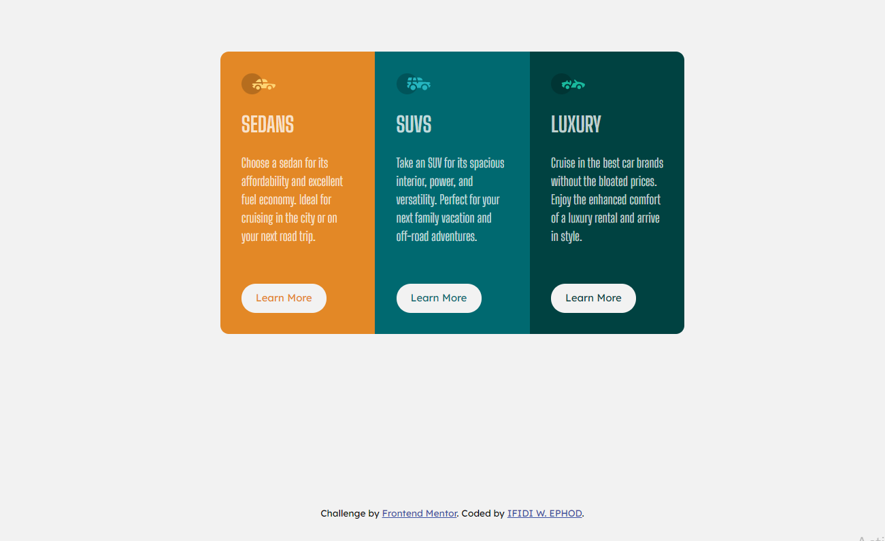
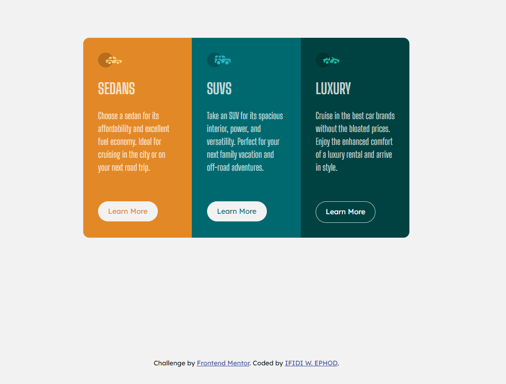
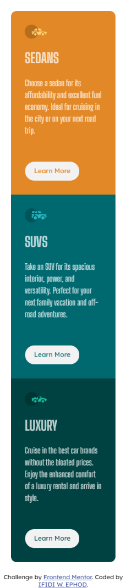

# Frontend Mentor - 3-column preview card component solution

This is a solution to the [3-column preview card component challenge on Frontend Mentor](https://www.frontendmentor.io/challenges/3column-preview-card-component-pH92eAR2-). Frontend Mentor challenges help you improve your coding skills by building realistic projects.

## Table of contents

- [Overview](#overview)
  - [The challenge](#the-challenge)
  - [Screenshot](#screenshot)
  - [Links](#links)
- [My process](#my-process)
  - [Built with](#built-with)
  - [What I learned](#what-i-learned)
  - [Continued development](#continued-development)
  - [Useful resources](#useful-resources)
- [Author](#author)
- [Acknowledgments](#acknowledgments)

## Overview

This is a design of a 3-culumn-preview-card using HTML and CSS.
In this design I also added a transition to the card info using @keyframes to that.
I approached it using grid layering.

### The challenge

Users should be able to:

- Desktop first then Mobile approach
- On hover of the button you have the state displayed for it.

### Screenshot


Desktop View


Active-State View


Mobile View


### Links

- Solution URL: [https://github.com/winsofttutorials/3-column-preview-card-component-main.git]
- Live Site URL: [https://winsofttutorials.github.io/3-column-preview-card-component-main/]

## My process

I used grid to set up my layers.
@min-width: 600px i had the break to a mobile screen.

### Built with

- Semantic HTML5 markup
- CSS custom properties
- Flexbox
- CSS Grid
- Mobile-first workflow
- [React](https://reactjs.org/) - JS library
- [Next.js](https://nextjs.org/) - React framework
- [Styled Components](https://styled-components.com/) - For styles

### What I learned

It helped me improve on my Responsive designing.

To see how you can add code snippets, see below:

```html
<h1>Some HTML code I'm proud of</h1>
```

```css
.proud-of-this-css {
  color: papayawhip;
}
```

```js
const proudOfThisFunc = () => {
  console.log("🎉");
};
```

If you want more help with writing markdown, we'd recommend checking out [The Markdown Guide](https://www.markdownguide.org/) to learn more.

### Continued development

Using toggle bottun to change into a dark mode or light mode

### Useful resources

- [Example resource 1](https://frontendmentor.io) - This helped me with the resources needed to design this card
- [Example resource 2](https://www.example.com) - This is an amazing article which helped me finally understand XYZ. I'd recommend it to anyone still learning this concept.

## Author

- Website - [IFIDI W. EPHOD](https://www.your-site.com)
- Frontend Mentor - [@winsofttutorials](https://www.frontendmentor.io/profile/winsofttutorials)
- Twitter - [@IFIDIKUROEPHOD](https://www.twitter.com/IFIDIKUROEPHOD)

## Acknowledgments

Special regards to @Khalid who always finds time to drop a note for me so i can improve. And a big thanks to every other frontend dev who always drop works that motivate me.

Special thanks to my mentor @Avinash under whose care i have grown
